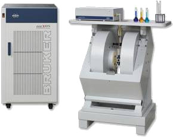
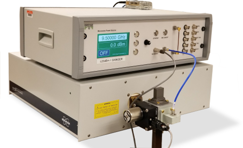

{::options parse_block_html="true" /}

# {{page.title}}

Our lab conducts Overhauser DNP (Dynamic Nuclear
Polarization) on liquid state and soft matter systems.
This technique is a dual-resonance technique that
involves simultaneous excitation of Electron Spin and
Nuclear Spin resonances (ESR and NMR).

We implement these technologies to study both
biochemical and materials systems,
and have therefore built up a full complement of
instruments that enable protein expression and
purification,
in addition to standard synthetic capabilities.

## Bruker ELEXSYS-II ESR Spectrometer

With its SuperX bridge the [Bruker ELEXSYS](https://www.bruker.com/products/mr/epr/elexsys/e500/overview.html){:target="blank"} spectrometer offers
the latest in digital signal acquisition technology,
allowing us to acquire high-quality cw ESR (electron
spin resonance) spectra.
Crucially, the ELEXSYS also comes equipped with
advanced scripting capabilities that synchronize the
instrument with our microwave amplifier and NMR
spectrometer,
allowing us to perform the dual-resonance NMR+ESR
experiments that our lab specializes in.

## Bridge12 Microwave Amplifier

We have integrated a high-power microwave amplifier built by
[Bridge12 Technologies](http://www.bridge12.com/){:target="blank"}
to our custom specifications
into our ESR spectrometer system.
This system,
which generates high power microwaves to saturate ESR
transitions,
also offers communication with automation scripts.

## Home-Built NMR Spectrometer

In order to optimize the integration of 
NMR (nuclear spin resonance) and ESR (electron spin resonance),
we wanted to customize the design of our NMR spectrometer,
eliminating all but the most essential components.
Exceeding our expectations, we have implemented a very
minimalistic design that currently employs standard
test and measurement components as well as home-built
circuitry to observe low-frequency low-volume NMR with high
signal to noise.

## Biochemical Wetlab

A ThermoFisher X1R centrifuge combines with
microcentrifuges, incubators, and refrigeration
equipment (including the new Stirling Engine -85°C
freezer purchased in conjunction with the Mozhdehi an
Steinhardt labs) to form a full complement of
biochemical tools.
